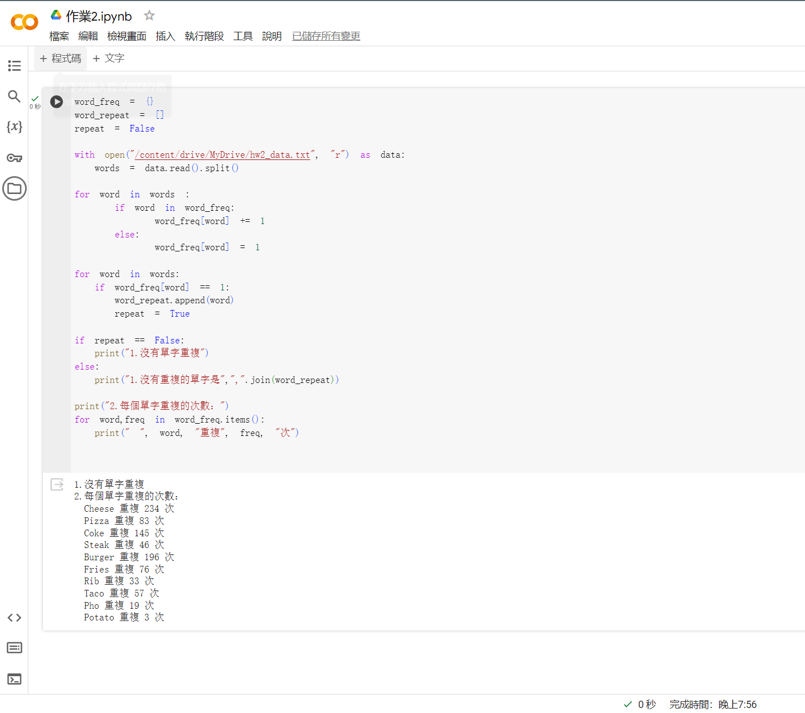

# 作業2 - 計算文字出現次數與頻率

### code
```
word_freq = {}
word_repeat = []
repeat = False

with open("/content/drive/MyDrive/hw2_data.txt", "r") as data:
  words = data.read().split()

for word in words :
    if word in word_freq:
        word_freq[word] += 1
    else:
        word_freq[word] = 1

for word in words:
  if word_freq[word] == 1:
    word_repeat.append(word)
    repeat = True

if repeat == False:
  print("1.沒有單字重複")
else:
  print("1.沒有重複的單字是",",".join(word_repeat))

print("2.每個單字重複的次數：")
for word,freq in word_freq.items():
  print(" ", word, "重複", freq, "次")
```

### 執行結果


